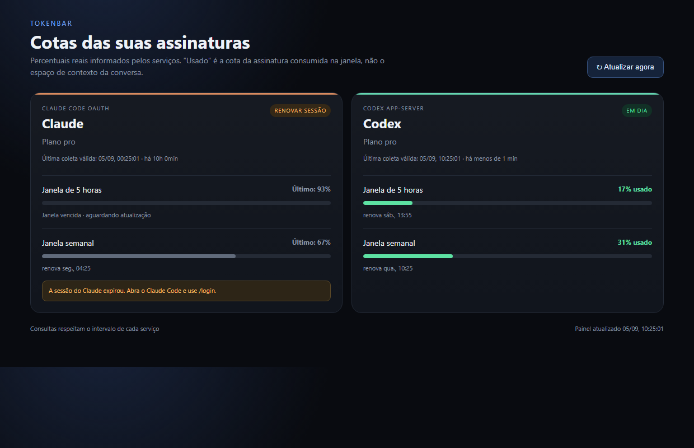
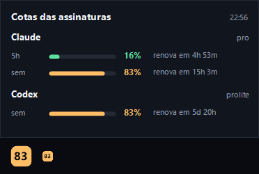

# TokenBar

Painel unificado para acompanhar a **cota real das assinaturas** Claude e Codex, sem
confundi-la com as outras três coisas que costumam ser chamadas de "tokens":

| O que é | O que o TokenBar mostra |
| --- | --- |
| Tokens da conversa / janela de contexto | ❌ não |
| Custo de chamadas feitas com chave de API | ❌ não |
| Cota da assinatura em janelas móveis (5h, semanal) | ✅ sim |

O TokenBar existe como **extensão do VS Code** e como **indicador na bandeja do Windows**,
para quem usa Zed, Antigravity ou qualquer outro editor. Os dois compartilham o mesmo
coletor.

## Sumário

- [Instalação](#instalação)
- [Uso](#uso)
- [Configuração](#configuração)
- [Bandeja do Windows](#bandeja-do-windows)
- [Como os dados são obtidos](#como-os-dados-são-obtidos)
- [Privacidade e credenciais](#privacidade-e-credenciais)
- [Desenvolvimento](#desenvolvimento)
- [Documentação adicional](#documentação-adicional)
- [Licença](#licença)

## Requisitos

- VS Code `^1.75.0` (ou editor compatível com a API de extensões do VS Code).
- Node.js 18+ para compilar.
- Para o provedor **Claude**: [Claude Code](https://claude.com/claude-code) instalado e com
  login feito (o TokenBar reaproveita a sessão OAuth já existente).
- Para o provedor **Codex**: o CLI `codex` instalado e autenticado.
- Para a bandeja: Windows com PowerShell 5.1+.

## Instalação

Ainda não há publicação no Marketplace. Compile e instale o `.vsix` localmente:

```powershell
npm install
npm run compile
npm run package
code --install-extension tokenbar.vsix
```

## Uso



Depois de ativada, a extensão mostra na barra de status a janela **mais crítica** entre
todos os provedores, no formato `Claude 84%` — onde o número é a cota já **usada** na janela.

| Comando | Ação |
| --- | --- |
| `TokenBar: Open Dashboard` | Abre o painel com uma barra por janela |
| `TokenBar: Atualizar cotas` | Força uma coleta imediata, com notificação de progresso |

Clicar no indicador da barra de status também abre o painel.

## Configuração

| Chave | Tipo | Padrão | Faixa | Descrição |
| --- | --- | --- | --- | --- |
| `tokenbar.refreshInterval` | `integer` | `60` | 15–3600 | Intervalo, em segundos, entre coletas automáticas. |

O intervalo vale para o agendamento local. O coletor do Claude aplica o próprio piso de
5 minutos entre chamadas de rede (veja [Como os dados são obtidos](#como-os-dados-são-obtidos)),
então baixar esse valor não aumenta a frequência real de consulta ao Claude.

## Bandeja do Windows



*Painel da bandeja. Embaixo, o ícone nos dois tamanhos que o Windows pede — ele mostra o
percentual mais crítico e muda de cor conforme a cota aperta. Imagem gerada pelo próprio
projeto com `tray\tokenbar.ps1 -PreviewPath`.*

Para acompanhar as cotas fora do VS Code, o mesmo coletor roda como daemon e alimenta um
indicador na bandeja:

```powershell
npm run compile-daemon
wscript tray\tokenbar.vbs
```

- `dist/daemon.js` mantém o `UsageManager` vivo — preservando o cache de 5 minutos e o
  backoff de 429 do Claude — e publica `%LOCALAPPDATA%\tokenbar\snapshot.json` de forma
  atômica (escreve `.tmp` e renomeia).
- `tray/tokenbar.ps1` **apenas lê** esse arquivo: desenha o ícone com o percentual mais
  crítico, o tooltip resumido e o painel com uma barra por janela e o tempo até a renovação.
  Ele nunca fala com Claude ou Codex diretamente.
- Clique esquerdo abre o painel; clique direito traz "Atualizar agora", "Iniciar com o
  Windows" e "Sair". "Atualizar agora" cria `refresh.flag` no diretório de estado, que o
  daemon observa e consome.
- `tray\tokenbar.ps1 -PreviewPath saida.png` renderiza o painel num PNG, sem abrir a GUI —
  útil para testar o layout.
- "Iniciar com o Windows" cria/remove um atalho `TokenBar.lnk` na pasta de Inicialização
  do usuário.

> Extensão e bandeja mostram o mesmo número: o percentual **usado** na janela, igual ao
> `/usage` do Claude Code. As faixas de cor também são as mesmas — verde abaixo de 70%,
> âmbar a partir de 70%, vermelho a partir de 90%.

Na bandeja, o painel compacto mostra as barras, percentuais e tempo até a renovação.
O indicador discreto `cache` e a cor cinza identificam dados antigos. Janelas vencidas
ficam sem preenchimento até uma nova coleta, sem presumir 0%. O ícone mostra o maior
percentual válido, ou `?` quando não há uma leitura atual.

No painel da extensão, cada provedor mostra a **última coleta válida**, a idade do dado
e a próxima tentativa. Se aparecer **renovar sessão**, abra o Claude Code e use `/login`.
O TokenBar volta a ler as credenciais nos ciclos seguintes, sem modificar o arquivo de login.

## Como os dados são obtidos

### Claude

1. Lê `~/.claude/.credentials.json`, o arquivo de sessão que o Claude Code já mantém, e
   extrai `claudeAiOauth.accessToken` e `claudeAiOauth.subscriptionType`.
2. Faz `GET https://api.anthropic.com/api/oauth/usage` com esse token no header
   `Authorization` e o header `Anthropic-Beta: oauth-2025-04-20`.
3. Converte a resposta em janelas: `five_hour`, `seven_day` e cada entrada de `limits` com
   `kind === "weekly_scoped"` (limites semanais separados por modelo).

Resiliência:

- **Piso de 5 minutos** entre chamadas de rede — coletas mais frequentes devolvem o último
  dado válido, marcado como `stale`, ou o último diagnóstico se ainda não houver dado.
- **Backoff em HTTP 429**, respeitando integralmente o header `Retry-After` quando presente,
  ou 5 minutos por padrão. A próxima tentativa é persistida, inclusive sem cache, e
  sobrevive a reinícios.

As duas guardas valem desde a primeira coleta, inclusive numa instalação que ainda não
consultou o serviço com sucesso. "Atualizar agora" também respeita as duas guardas.
- **Prazo total de 10 s**, incluindo conexão e corpo inteiro. Respostas interrompidas
  são encerradas e tentadas novamente no próximo ciclo permitido.
- **Isolamento por provedor**: cada resultado é publicado assim que chega. Um prazo de
  15 s no gerenciador cancela coletores pendurados e permite a próxima atualização.
- **Validação**: percentuais ausentes/inválidos e datas inválidas geram diagnóstico;
  o último dado válido é preservado.
- Um `401` é traduzido em "a sessão do Claude expirou; entre novamente no Claude Code".

> ⚠️ **Endpoint não documentado.** `/api/oauth/usage` não faz parte da API pública da
> Anthropic. Ele é o mesmo endpoint que o `/usage` do Claude Code consome, mas pode mudar
> ou sair do ar sem aviso, e seu uso por ferramentas de terceiros não é coberto por
> nenhuma garantia ou suporte. Leia [SECURITY.md](SECURITY.md) antes de usar.

### Codex

1. Sobe `codex app-server --stdio` como processo filho (no Windows, procurando
   `%APPDATA%\npm\codex.cmd` primeiro e depois o PATH).
2. Troca mensagens JSON por linha: `initialize` (id 1) → `initialized` →
   `account/rateLimits/read` (id 2).
3. Converte cada janela `primary`/`secondary` de cada limite. A duração devolvida pelo
   serviço identifica a janela: 300 min → "5 horas", 10080 min → "semanal", qualquer outro
   valor vira um rótulo genérico. O processo é encerrado assim que a resposta chega.

Timeout de 12 s. Se o CLI não existir, o provedor aparece como indisponível — não como erro.

## Privacidade e credenciais

- O TokenBar **lê** credenciais locais (`~/.claude/.credentials.json`) apenas para
  autenticar a consulta ao serviço correspondente.
- Tokens de acesso **nunca** são gravados pelo TokenBar, nem enviados para qualquer
  servidor que não seja o do próprio provedor.
- Não há telemetria. Não há servidor do TokenBar.
- O painel e o snapshot em disco recebem apenas: percentuais, horários de renovação, nome
  do plano e mensagens de diagnóstico.
- O snapshot fica em `%LOCALAPPDATA%\tokenbar\snapshot.json`, com as permissões padrão do
  perfil do usuário.

Os diagnósticos ficam em `%LOCALAPPDATA%\tokenbar\diagnostics.jsonl`; a extensão usa
seu diretório `globalStorage`. Há dois arquivos de até 256 KiB cada, com rotação automática.
Eles registram estado, duração e horários de coleta/tentativa, sem tokens, mensagens
remotas, headers ou corpos de resposta.

Detalhes completos, incluindo superfície de ataque e como reportar vulnerabilidades, em
[SECURITY.md](SECURITY.md).

## Desenvolvimento

```powershell
npm install
npm run compile      # extensão + daemon
npm test             # unidades e regressões de coleta
npm run test:tray     # testes Windows, sem abrir a GUI
```

Pressione `F5` no VS Code para abrir uma janela de desenvolvimento da extensão.

Scripts disponíveis:

| Script | O que faz |
| --- | --- |
| `npm run compile` | Compila extensão e daemon |
| `npm run compile-extension` | Só `dist/extension.js` |
| `npm run compile-daemon` | Só `dist/daemon.js` |
| `npm run compile-preview` | Só `dist/preview.js`, o gerador de capturas do painel |
| `npm run watch` | Recompila a extensão a cada alteração |
| `npm test` | Compila e roda `src/test/test.ts` |
| `npm run package` | Gera `tokenbar.vsix` |

Veja [CONTRIBUTING.md](CONTRIBUTING.md) para o fluxo de contribuição e
[docs/arquitetura.md](docs/arquitetura.md) para o desenho dos módulos.

## Documentação adicional

- [docs/arquitetura.md](docs/arquitetura.md) — módulos, fluxo de dados e contratos.
- [SECURITY.md](SECURITY.md) — modelo de ameaças, tratamento de credenciais e reporte.
- [CONTRIBUTING.md](CONTRIBUTING.md) — como contribuir.
- [CODE_OF_CONDUCT.md](CODE_OF_CONDUCT.md) — código de conduta.
- [CHANGELOG.md](CHANGELOG.md) — histórico de versões.

## Licença

[MIT](LICENSE) © Paulo Gomes
